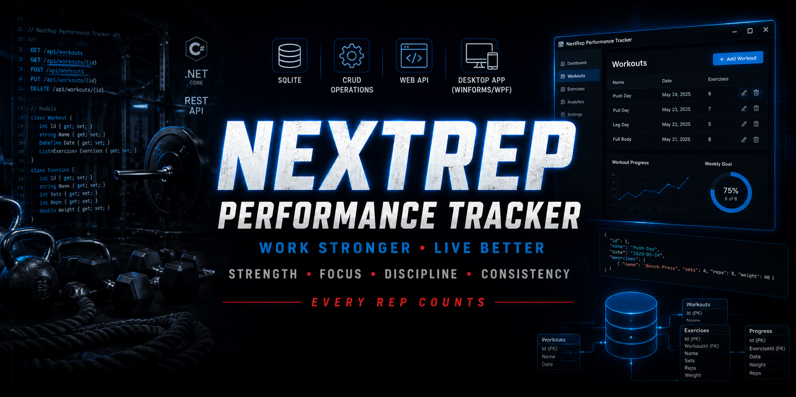
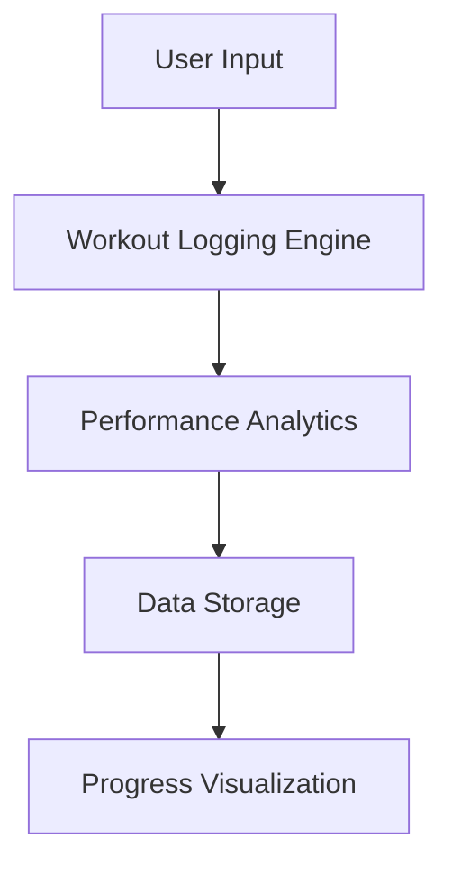
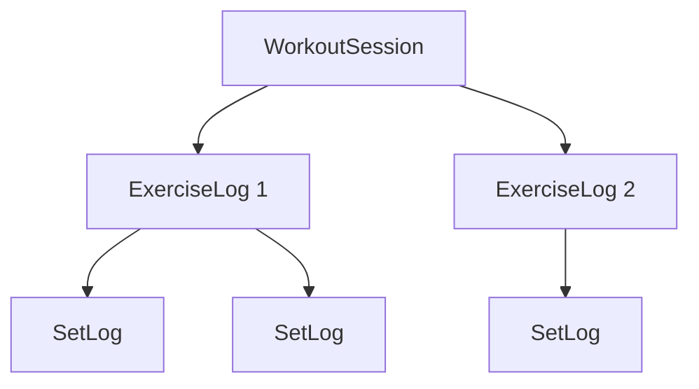
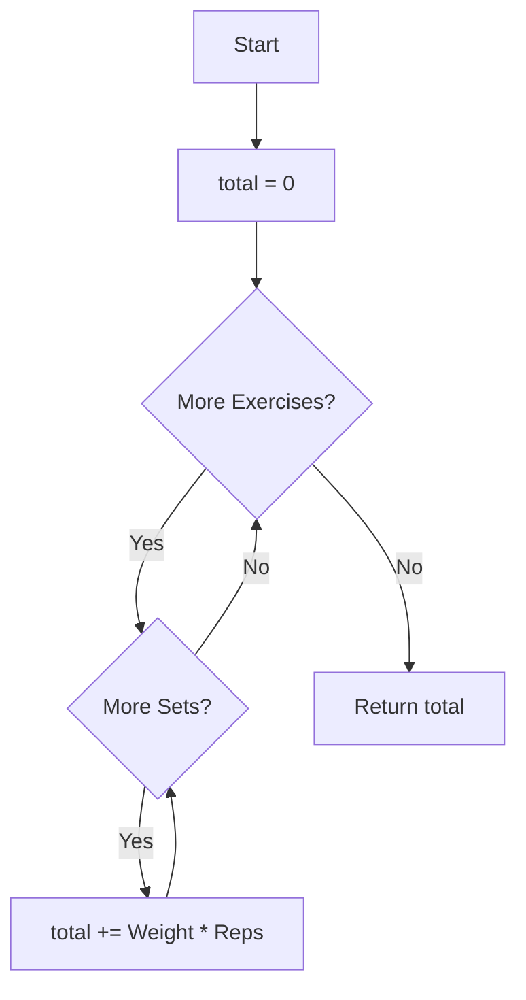
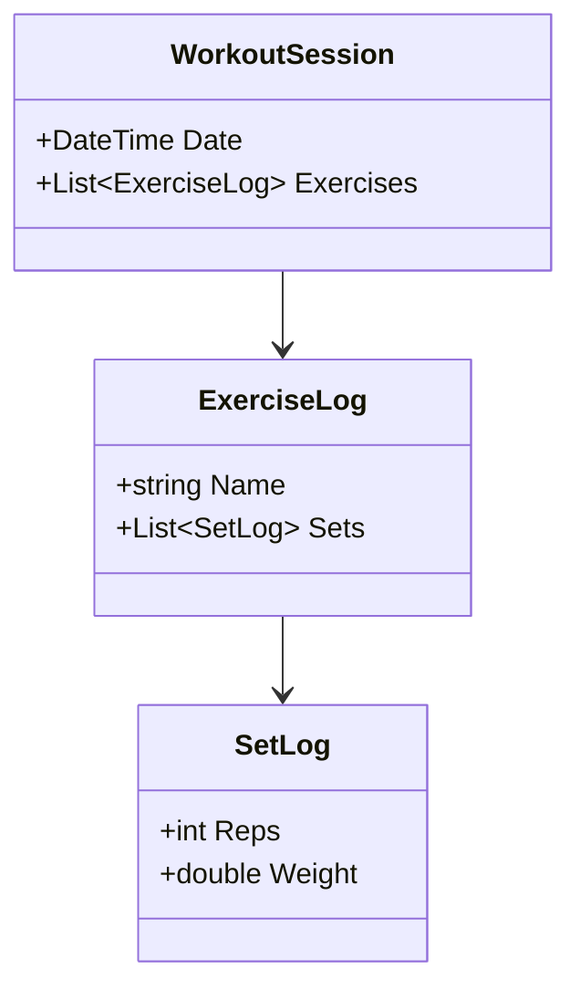
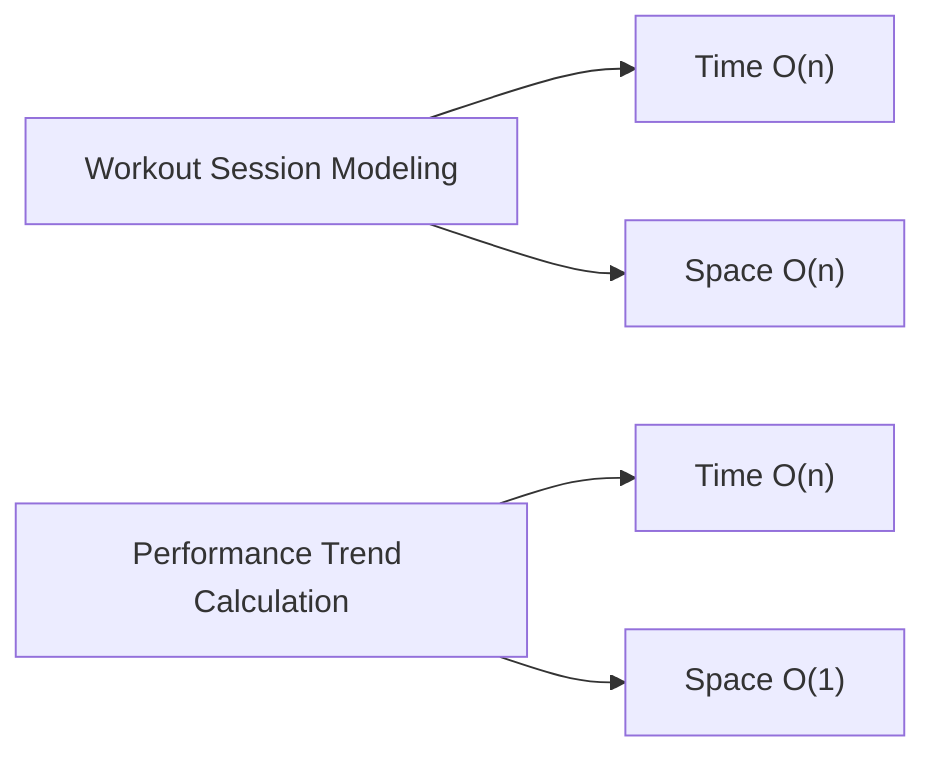

# 🚀 NextRep Performance Tracker — Elite Athlete Performance App


---

## 🔥 Executive Summary

NextRep Performance Tracker is a high‑discipline workout engine built for athletes who demand structure, consistency, and measurable progress.

Every rep counts — and this app ensures every rep is tracked, analyzed, and used to build a stronger athlete. This system focuses on clean engineering, optimized C# architecture, and a professional‑grade user experience.

---

## 🎯 Core Features

| Feature | Description | Category |
|---------|-------------|----------|
| Workout Logging Engine | Track sets, reps, weight, intensity; auto‑calculate volume, PRs, and progression | Logging |
| Performance Analytics | Volume trends, strength progression, consistency metrics, weekly/monthly breakdowns | Analytics |
| Exercise Library | Categorized by muscle group with cues, form notes, and difficulty levels | Reference |
| Athlete Profile System | Bodyweight tracking, goal setting, training‑phase management | Profile |

---

## 🏗 Architecture Overview



---

## 📂 Project Structure

```text
NextRep_Performance_Tracker
│
├── Models
│   ├── WorkoutSession.cs
│   ├── ExerciseLog.cs
│   └── SetLog.cs
│
├── Services
│   ├── AnalyticsService.cs
│   └── WorkoutService.cs
│
└── Program.cs
```

---

# 🧩 Problem 1 — Workout Session Modeling

**Category:** Data Modeling / Architecture

---

## 🧠 Summary

Design a clean, scalable model for workouts, exercises, sets, and metrics. A session holds many exercises, and each exercise holds many sets — a one‑to‑many tree that mirrors how an athlete actually trains.

---

## 🔁 Model Relationship



---

## ✅ C# Model

```csharp
public class WorkoutSession
{
    public DateTime Date { get; set; }
    public List<ExerciseLog> Exercises { get; set; } = new();
}

public class ExerciseLog
{
    public string Name { get; set; }
    public List<SetLog> Sets { get; set; } = new();
}

public class SetLog
{
    public int Reps { get; set; }
    public double Weight { get; set; }
}
```

---

## ⏱ Complexity

| Metric | Complexity |
|--------|------------|
| Time | **O(n)** |
| Space | **O(n)** |

---

# 🧩 Problem 2 — Performance Trend Calculation

**Category:** Algorithms / Data Processing

---

## 🧠 Summary

Compute total training volume across a session by walking every set inside every exercise and summing `weight × reps`. One pass, constant extra memory.

---

## 🔁 Flowchart



---

## 🧪 Dry Run

Session: Bench `[ 100×5, 100×5 ]`, Squat `[ 200×5 ]`

| Exercise | Set | Weight × Reps | Running Total |
|----------|----:|--------------:|--------------:|
| Bench | 1 | 100 × 5 = 500 | 500 |
| Bench | 2 | 100 × 5 = 500 | 1000 |
| Squat | 1 | 200 × 5 = 1000 | 2000 |

**Total Volume = 2000**

---

## 🧾 Pseudocode

```text
SET total = 0

FOR each exercise in session
    FOR each set in exercise
        total = total + (set.Weight * set.Reps)

RETURN total
```

---

## ✅ C# Method

```csharp
public static double CalculateTotalVolume(WorkoutSession session)
{
    double total = 0;

    foreach (ExerciseLog exercise in session.Exercises)
        foreach (SetLog set in exercise.Sets)
            total += set.Weight * set.Reps;

    return total;
}
```

---

## ⏱ Complexity

| Metric | Complexity |
|--------|------------|
| Time | **O(n)** |
| Space | **O(1)** |

---

# 🧩 Class Diagram



---

# 📊 Complexity Comparison



---

# ▶️ Sample Output

```text
NextRep Performance Tracker

Session Date: 2026-06-25
Exercises Logged: 2

Total Volume: 2000
Top Set: Squat 200 x 5
```

---

# 🧭 How to Run

1. Clone the repository
2. Open the solution in Visual Studio
3. Build the project
4. Run (F5)
5. Begin logging workouts and tracking performance

---

# 💻 Technologies Used

| Technology | Purpose |
|------------|---------|
| C# | Programming Language |
| .NET 8 | Target Framework |
| Console / API | Application Type |
| Object‑Oriented Design | Workout & Set Modeling |
| Collections | Session and Set Storage |
| Visual Studio | Development Environment |

---

# 🧠 Key Concepts Demonstrated

- Data Modeling
- One‑to‑Many Relationships
- Object‑Oriented Design
- Nested Iteration
- Aggregation Algorithms
- Big‑O Analysis
- Clean C# Code
- Scalable Architecture

---

# 👨‍💼 Author

**Robert (Bobby) Rovy**  
- 🇺🇸 U.S. Army Veteran  
- Microsoft Software & Systems Academy  
- AZ‑104 Certified  
- Aspiring Software Engineer
